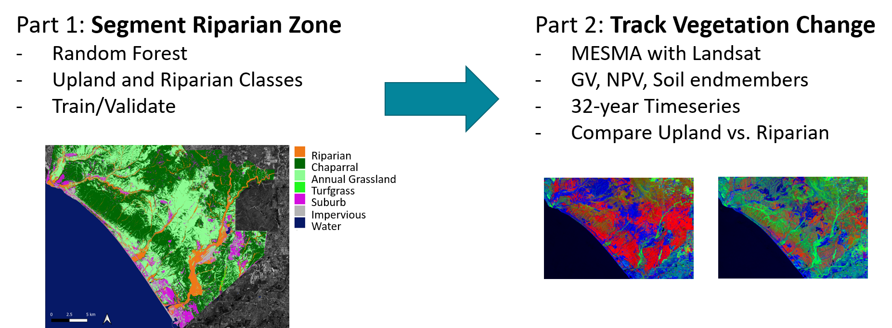
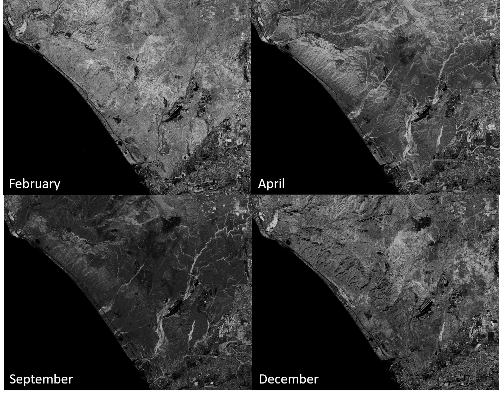
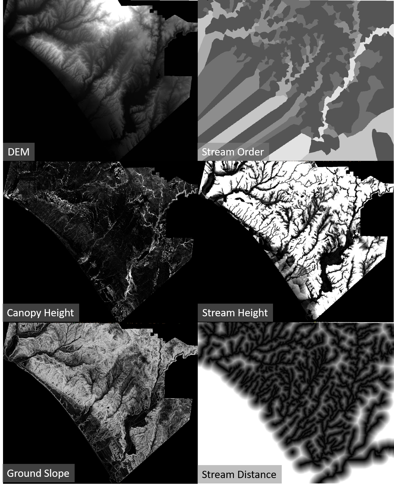
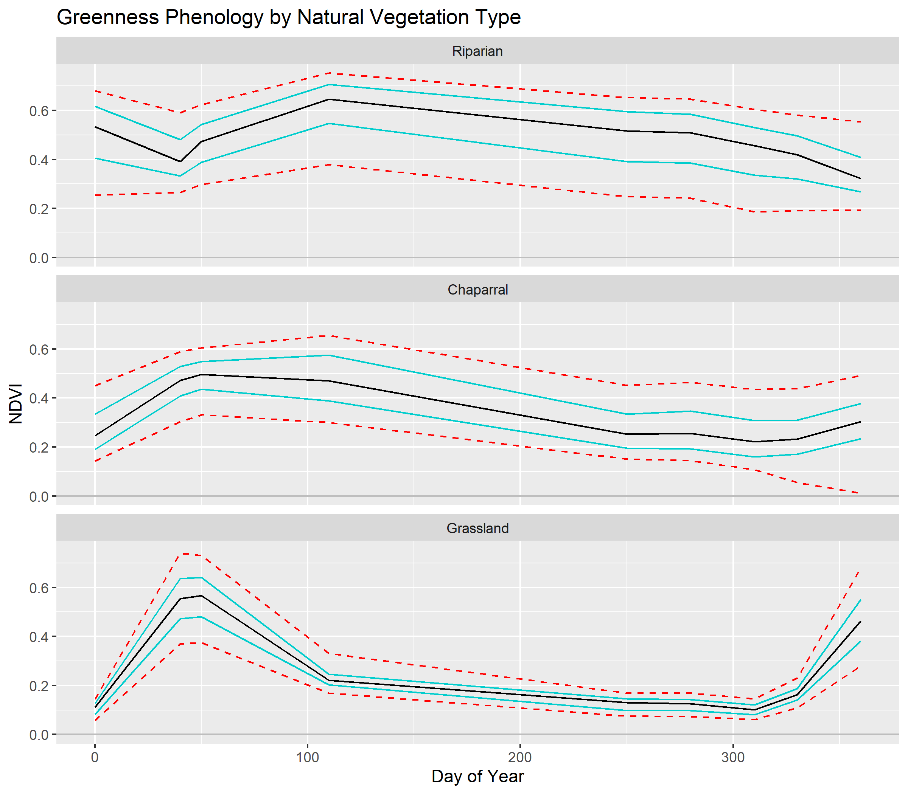
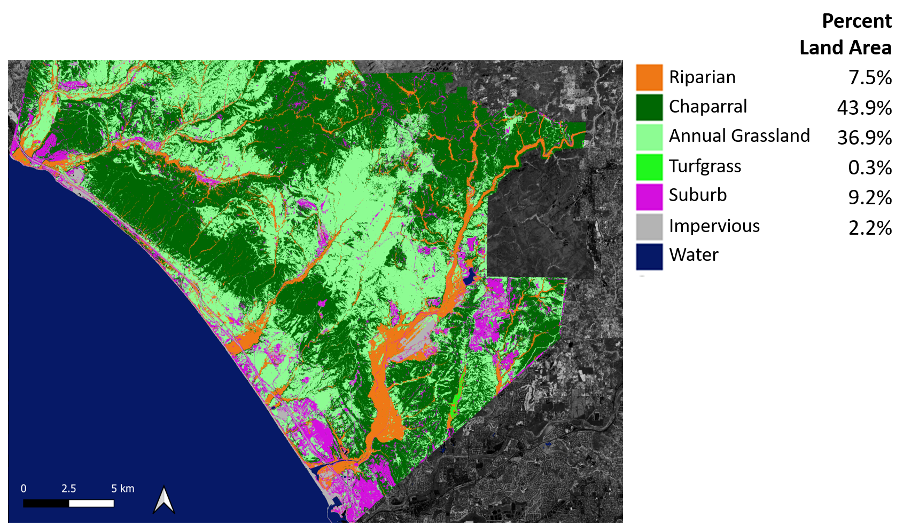
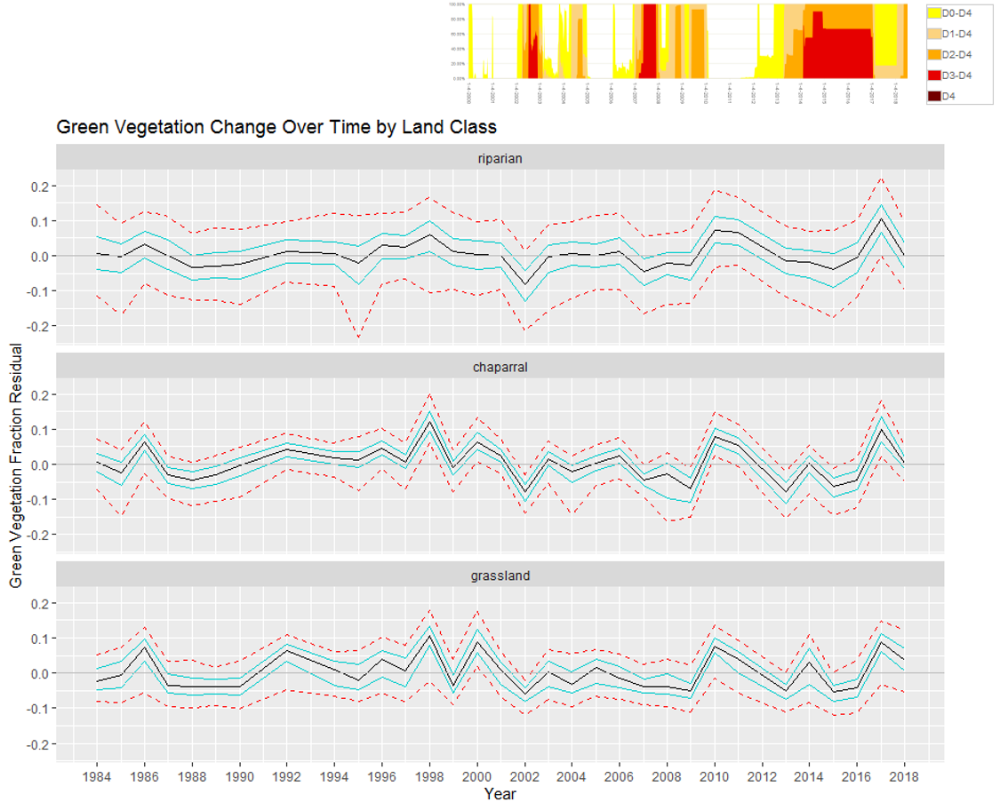

# Riparian Vegetation Stats and Land Classifier

Code to generate statistics describing several land cover classes and to then classify them using a random forest classifier in R.

  

**Classes:**
- Riparian Vegetation
- Chaparral 
- Annual Grassland
- Suburb (combination of buildings and suburban vegetation)
- Irrigated Turfgrass
- Impervious Pavement
- Water

# Data Preprocessing

First, two datasets are generated: one optical (NDVI phenology) and one active (LiDAR structural metrics).

  

**Example Sentinel 2 NDVI images shown above for four dates in 2016.**

  

**Example structural metrics from LiDAR shown above.**

- DEM: digital elevation model from 0 to 880 m
- Canopy Height: height of canopy above DEM
- Ground Slope: local terrain slope, from 0 to 90 degrees
- Stream Order: Strahler stream number of nearest flowline, ranging here from 1 to 9, derived from NHDPlus
- Stream Height: vertical distance to nearest stream flowline, here thresholded from 0 to 30 m
- Stream Distance: lateral distance to nearest stream flowline, here thresholded from 0 to 300 m

** Example phenological information for the three vegetation classes considered herein:

  

Using the above information, a class map was generated: 

  

# Drought Response Assessment

Following generation of vegetation classes, MESMA was run on a 32-year Landsat timeseries to generate GV, NPV, and soil fractions. Fractional cover within each vegetation class was modeled over time and compared to a drought timeseries: 

  

